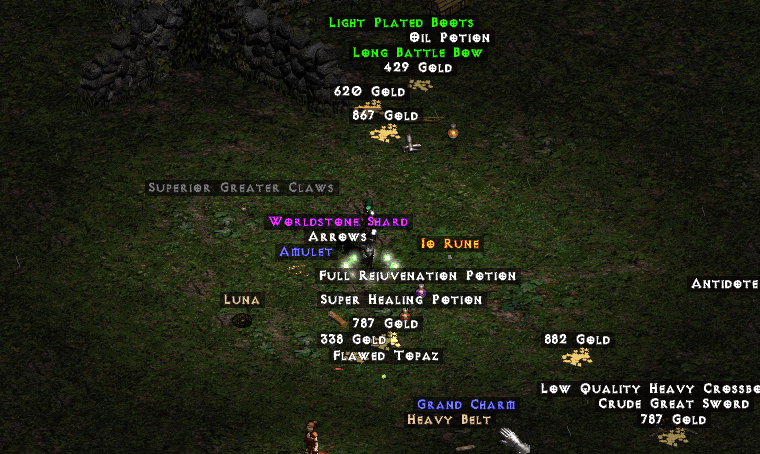
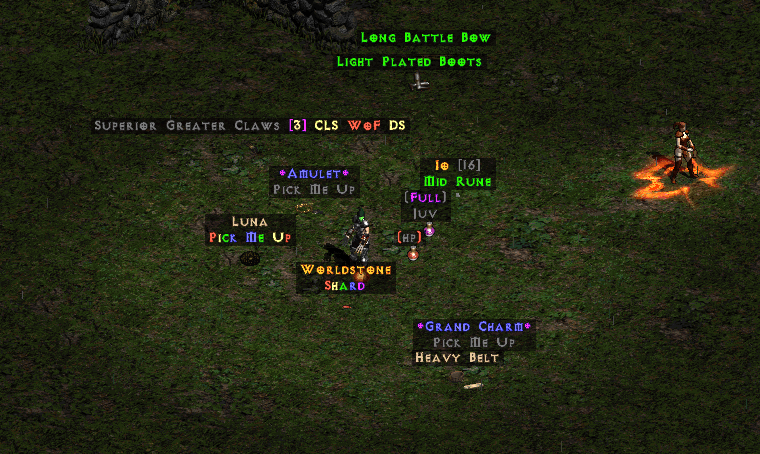
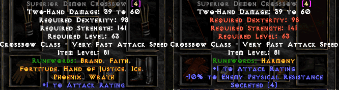
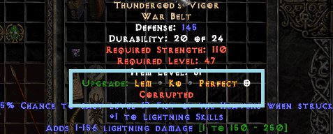

# NED2
### _Ned Enhances Diablo 2_

NED2 is a simple, minimal, and reliable filter made for *Project Diablo 2*. It aims to balance useabilty with aesthetics giving an overall better PD2 experience. Components, such as Runeword applicability, are built algorithmically using a custom database, which both improves completeness and minimizes the overall size of the filter.

## Features

- Filtering and Runeword applicability that *scales with player level*
- Skill mods and item qualities (ethereal, sockets, etc.) appended to item name
- In-item recipes for Rares, Uniques, and Maps
- Cohesive aesthetic that improves the 'clickability' of useful items

This filter is made to be useful by characters of all levels, providing information and items that are relevant at each stage of the game. While NED2 will filter out many items by lategame, it will leave the player with sufficient choice with what is left. 

## What is filtered?

Before choosing this, or any other filter, you should be aware of what stays and what goes. 

### Items Always Shown

- Uniques, Sets, and Rares
- Circlets
- Runes, Flawless Gems, and Perfect Gems
- Elite Class Items
- All Class Items with a Socket
- Special items like Worldstone Shards
- Elite Magic Items 

### Items Hidden Based on Character Level
- Non-Elite Magic Items
- Gold
- Potions
- Non-Socketed, Non-Class Items
- Items with 1 or 2 sockets
- Large Charms
- Keys, Misc Potions, and Town Portals

### Items Never Shown
- Inferior Items (past level 3)

## Screenshots
#### No Filter Applied (Vanilla)

#### NED2 Applied

#### Applicable Runewords by Level

#### Upgrading Recipes

## Installation
*Ensure that you make a backup copy of your existing default.filter file!*
1. Download **default.filter**
2. Move the file to your Project Diablo 2 directory
   1. This is usually `C:\Program Files (x86)\Diablo II\ProjectD2`
   2. If asked to replace the existing file, select yes

Alternatively, copy and paste the contents of this filter into the **default.filter** file on your computer.